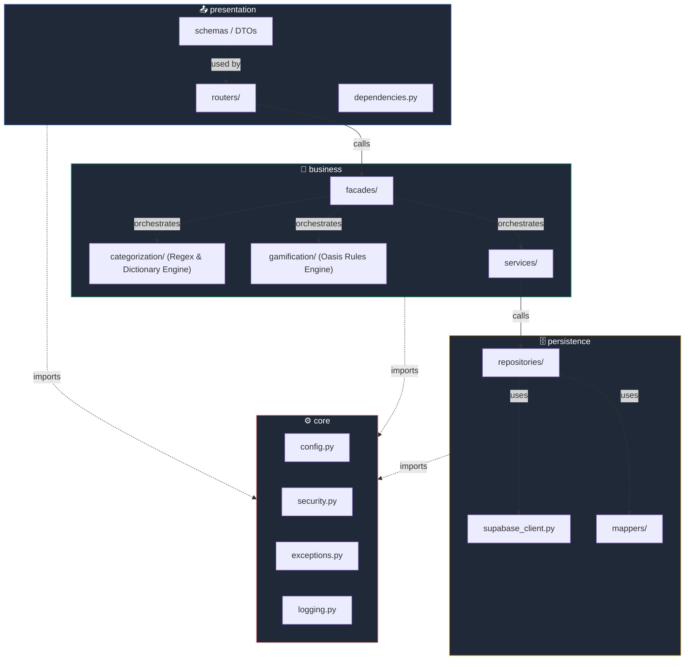
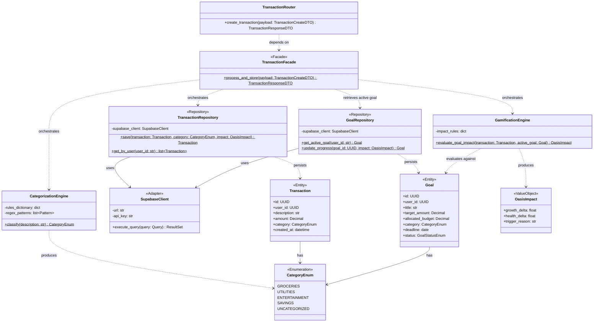
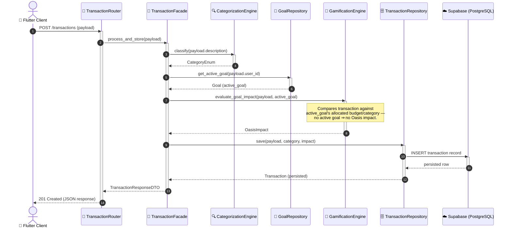

ئ<div align="center">

# 🏛️ Athar-Fintech — Software Architecture

**Design Document · Layered Architecture + Facade Pattern**

</div>

---

## 📖 Table of Contents

1. [Architectural Philosophy](#1-architectural-philosophy)
2. [Package Diagram](#2-package-diagram)
3. [Class Diagram](#3-class-diagram)
4. [Sequence Diagram — Transaction Ingestion Flow](#4-sequence-diagram--transaction-ingestion-flow)
5. [Design Rationale — Why Layered + Facade](#5-design-rationale--why-layered--facade)
6. [Extensibility Guidelines](#6-extensibility-guidelines)

---

## 1. Architectural Philosophy

Athar-Core's backend is built on two complementary architectural decisions:

| Decision | Purpose |
|----------|---------|
| **3-Tier Layered Architecture** (Presentation → Business → Persistence, plus a cross-cutting **Core**) | Enforces separation of concerns and a strict, one-directional dependency flow. No layer may skip another. |
| **Facade Design Pattern** | Provides a single, stable entry point into each Business module, hiding internal orchestration complexity (categorization → gamification → persistence) from the Presentation layer. |

The combination guarantees that **the API surface (Presentation) is decoupled from implementation details** in the Business and Persistence layers — meaning the categorization engine, the gamification rules, or even the underlying database provider (Supabase) can evolve independently without breaking route contracts.

**Dependency Rule:** A layer may only depend on the layer directly beneath it. `Core` is the exception — it has no dependencies and may be imported by any layer.

```
Presentation  ──depends on──▶  Business  ──depends on──▶  Persistence
      │                            │                            │
      └────────────────────────────┴────────────▶  Core  ◀──────┘
```

---

## 2. Package Diagram

The package diagram below shows the four top-level packages inside `backend/app/`, their internal modules, and the **allowed** dependency directions between them.



**Key observations:**
- Solid arrows (`──▶`) represent **hard dependencies** (calls that cross layer boundaries via the Facade).
- Dotted arrows (`-.->`) represent **cross-cutting imports** of the `Core` package, which every layer is permitted to use.
- `presentation` never imports from `persistence` directly — this is enforced at code-review time and can be validated with import-linting tools (e.g., `import-linter`).

---

## 3. Class Diagram

The class diagram illustrates the core domain classes involved in transaction ingestion, focused on the **Facade Pattern** implementation.



**Key observations:**
- `TransactionFacade` is annotated `<<Facade>>` — it is the **only** class the Presentation layer is aware of within the Business layer.
- `TransactionRepository` and `GoalRepository` are annotated `<<Repository>>` and are the **only** classes permitted to speak to `SupabaseClient`.
- `GamificationEngine.evaluate_goal_impact()` takes the incoming `Transaction` **and** the user's currently `active_goal` (a `Goal` entity), rather than reacting to the transaction in isolation. This ties every Oasis change directly to progress against a concrete, user-defined objective.
- `OasisImpact` is a lightweight **Value Object** — immutable, and produced purely as a function of `(Transaction, Goal)`, keeping the Gamification Engine stateless and easily testable.

---

## 4. Sequence Diagram — Transaction Ingestion Flow

This sequence diagram traces a single incoming transaction from the API boundary through categorization, gamification evaluation, and persistence — the canonical example of the Facade orchestrating a multi-step Business operation.



**Key observations:**
- The **Router never talks to the Repository, the Categorization Engine, the Goal Repository, or the Gamification Engine directly** — every call is mediated by the Facade.
- Before invoking the Gamification Engine, the Facade fetches the user's **currently active `Goal`** via `GoalRepository.get_active_goal()`. If no goal is active, the Gamification Engine short-circuits with a neutral `OasisImpact` — the Oasis simply does not react to un-goaled spending.
- All four business operations (`classify`, `get_active_goal`, `evaluate_goal_impact`, `save`) execute as a single logical transaction from the client's perspective, even though they involve four internal collaborators.
- This flow is fully **offline-capable up to the persistence step** — no external network call occurs during categorization or goal-impact evaluation, in line with the Privacy-First USP.

---

## 5. Design Rationale — Why Layered + Facade

### 5.1 Testability
Each layer can be unit-tested in isolation. The `TransactionFacade` can be tested with mocked `CategorizationEngine`, `GamificationEngine`, `GoalRepository`, and `TransactionRepository` collaborators — no database or HTTP server required.

### 5.2 Goal-Driven Gamification (Not Blind Reactivity)
The Gamification Engine does not blindly react to every transaction. Instead, it evaluates how a transaction impacts the user's **active Financial Goal** (e.g., spending from the allocated goal budget vs. depositing into savings). It produces an `OasisImpact` — growth or decay — **only based on goal adherence**, never as a generic side effect of spending in general.

This distinction matters architecturally as much as it matters for product design:
- `GamificationEngine.evaluate_goal_impact()` requires an explicit `active_goal: Goal` parameter — there is no code path that produces an `OasisImpact` without one.
- If a user has no active goal, the Facade still persists the transaction normally, but the Gamification Engine is invoked with a neutral/no-op path, so the Oasis remains visually stable rather than reacting to noise.
- This keeps the Oasis meaningful as a **progress visualization tied to intent** (a goal the user set), rather than a generic mood-ring reaction to every coffee purchase.

### 5.3 Replaceability
Because `Presentation` only knows about `TransactionFacade`'s public method signature, the entire Business or Persistence layer can be re-implemented (e.g., swapping Supabase for another Postgres provider) with **zero changes to the Presentation layer or API contract**.

### 5.4 Reduced Cognitive Load
Developers working in Presentation never need to understand categorization rules or gamification logic — they only need to know the Facade's method signatures. This is critical for a small team (3 engineers) working across distinct focus areas concurrently.

### 5.5 Enforced Boundaries at Review Time
Because the pattern is structural (folder-enforced), code review can quickly catch violations: any `import` statement inside `presentation/` that reaches into `persistence/` or bypasses a Facade is an immediate red flag.

### 5.6 Alignment with Team Structure (Conway's Law)
The architecture intentionally mirrors the team's ownership boundaries:

| Layer / Concern | Primary Owner |
|------------------|----------------|
| Business (Categorization Engine), Persistence, Core | **Alanoud Aloraydi** |
| Flutter–Spline Integration, Gamification behavior mapping | **Reema Alshahrani** |
| Flutter UI/UX | **Sarah** |

---

## 6. Extensibility Guidelines

When adding a new capability to Athar-Core, follow this checklist:

1. **Define the Entity/DTO** in `business/` or `persistence/models/` as appropriate.
2. **Implement domain logic** in a dedicated `business/<feature>/` module — never inline it in a router.
3. **Expose exactly one Facade method** for the new capability; do not let routers call more than one Business collaborator directly.
4. **Add a Repository method** in `persistence/` if new data access is required — never call `SupabaseClient` from outside `persistence/`.
5. **Write unit tests** for the Facade with mocked collaborators, plus integration tests for the Repository against a test Supabase instance.
6. **Update this document** — every new cross-layer flow of significance should be reflected in the Sequence Diagram section.

