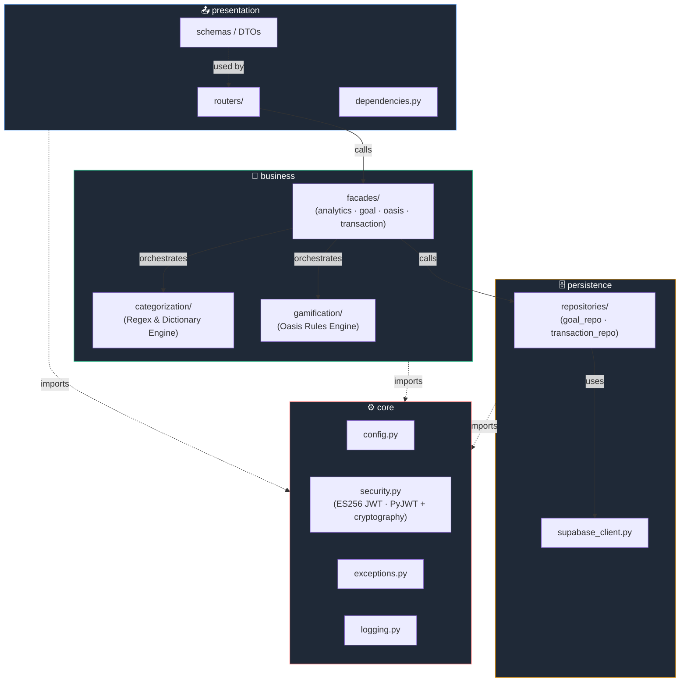
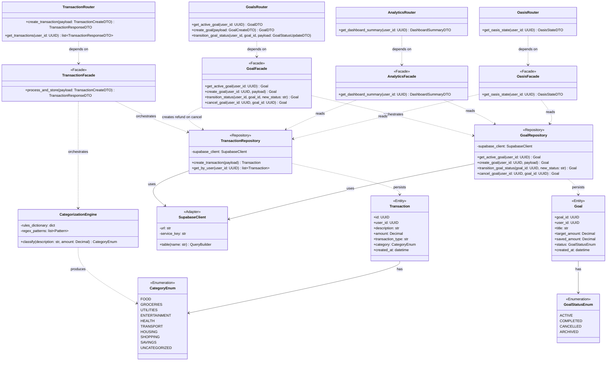
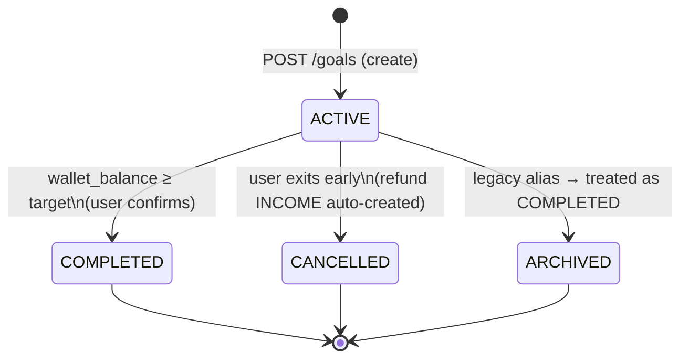
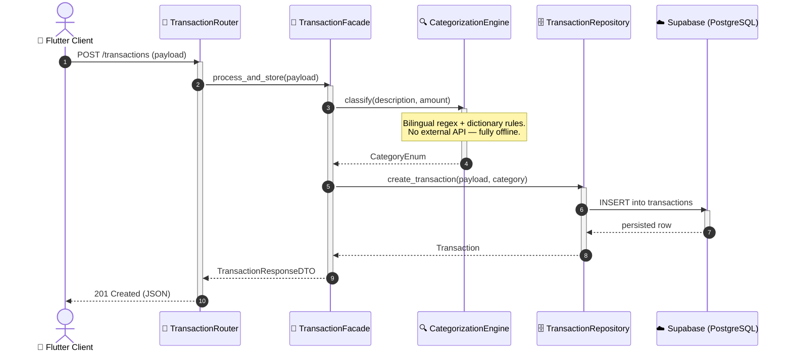
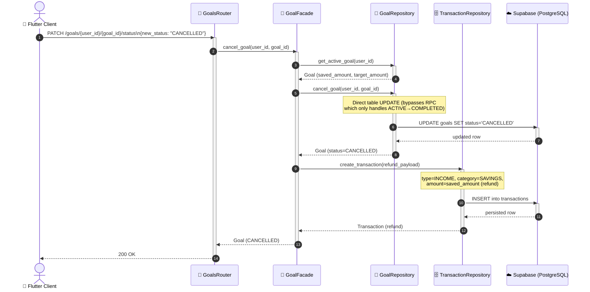

<div align="center">

# 🏛️ Athar-Fintech — Software Architecture

**Design Document · Layered Architecture + Facade Pattern**

</div>

---

## 📖 Table of Contents

1. [Architectural Philosophy](#1-architectural-philosophy)
2. [Package Diagram](#2-package-diagram)
3. [Class Diagram](#3-class-diagram)
4. [Financial Model & Goal Lifecycle](#4-financial-model--goal-lifecycle)
5. [Sequence Diagram — Transaction Ingestion Flow](#5-sequence-diagram--transaction-ingestion-flow)
6. [Sequence Diagram — Goal Cancellation Flow](#6-sequence-diagram--goal-cancellation-flow)
7. [Design Rationale — Why Layered + Facade](#7-design-rationale--why-layered--facade)
8. [Extensibility Guidelines](#8-extensibility-guidelines)

---

## 1. Architectural Philosophy

Athar's backend is built on two complementary architectural decisions:

| Decision | Purpose |
|----------|---------|
| **3-Tier Layered Architecture** (Presentation → Business → Persistence, plus a cross-cutting **Core**) | Enforces separation of concerns and a strict, one-directional dependency flow. No layer may skip another. |
| **Facade Design Pattern** | Provides a single, stable entry point into each Business module, hiding internal orchestration complexity (categorization → gamification → persistence) from the Presentation layer. |

The combination guarantees that **the API surface (Presentation) is decoupled from implementation details** in the Business and Persistence layers — meaning the categorization engine, the gamification rules, or even the underlying database provider (Supabase) can evolve independently without breaking route contracts.

**Dependency Rule:** A layer may only depend on the layer directly beneath it. `Core` is the exception — it has no dependencies and may be imported by any layer.

```
Presentation  ──depends on──▶  Business  ──depends on──▶  Persistence
      │                            │                            │
      └────────────────────────────┴────────────▶  Core  ◀──────┘
```

---

## 2. Package Diagram

The package diagram shows the four top-level packages inside `backend/app/`, their internal modules, and the **allowed** dependency directions between them.



**Key observations:**
- `presentation` never imports from `persistence` directly — every cross-layer call is mediated by a Facade.
- There are **four Facades**, each the sole public entry point of its Business module: `AnalyticsFacade`, `GoalFacade`, `OasisFacade`, `TransactionFacade`.
- `Core` has no outbound dependencies — it is the only package that any layer can import freely.

---

## 3. Class Diagram

The class diagram illustrates the core domain classes, focused on the **Facade Pattern** implementation and the actual entity fields in the current codebase.



**Key observations:**
- `GoalFacade.cancel_goal()` is distinct from `transition_status()` — it atomically updates the goal's status to `CANCELLED` **and** inserts a refund `INCOME` transaction into the Current Account, restoring the user's spending balance.
- `AnalyticsFacade` computes the **Two-Ledger** balance model (see Section 4) — it never reads a stored "current balance" field; it derives it from baseline constants and transaction aggregates.
- `Goal` does **not** have a `category` or `deadline` field — goal adherence is measured purely through the savings wallet balance vs. the target amount.
- `CategoryEnum` has exactly **10 values** — the single source of truth in `backend/app/business/categorization/models.py`, mirrored to Flutter as `AppCategory` in `models.dart`.

---

## 4. Financial Model & Goal Lifecycle

### 4.1 Two-Ledger Balance Model

Athar never stores a user's current balance as a literal database field. Instead, two virtual ledgers are computed on every dashboard request:

| Ledger | Formula | Baseline (SAR) |
|--------|---------|----------------|
| **Current Account** | `Baseline + Σ INCOME transactions − Σ EXPENSE transactions` | 8,500 |
| **Savings Wallet** | `Baseline + active_goal.saved_amount` | 15,000 |

**Why this matters architecturally:**
- Balance is always derived from raw transaction data — no risk of ledger drift between the balance field and the actual transaction history.
- The `AnalyticsFacade` is the **single source of truth** for both ledgers. The Dashboard screen and the Oasis (farm) tab both consume `DashboardSummaryDTO` from the same endpoint — guaranteeing that wallet balance, palm count, and health filter are always in sync across tabs.

### 4.2 Oasis Health Score & Daily Rate of Savings (DRS)

```
DRS = monthly_income − monthly_expenses − fixed_obligations − (10% safety_buffer)

oasis_health_score = clamp(0, 100, DRS / income × 100)
```

Palm count (1–9) and the CSS health filter applied to the Spline scene are derived **exclusively** from `DashboardSummaryDTO.oasisHealthScore` and the wallet-to-target ratio — never from a separate Oasis-specific API call.

### 4.3 Goal Lifecycle

All goal state transitions go through `PATCH /goals/{user_id}/{goal_id}/status`.



| Status | Trigger | Financial Side-Effect |
|--------|---------|----------------------|
| `COMPLETED` | `savings_wallet_balance >= target_amount` | Goal moves to history; wallet balance stays |
| `CANCELLED` | User requests cancellation | `saved_amount` refunded as an INCOME transaction to Current Account; Oasis resets to single palm |
| `ARCHIVED` | Legacy path | Identical to COMPLETED — no financial effect |

**Implementation note:** `CANCELLED` transitions bypass the Supabase RPC (which only handles ACTIVE→COMPLETED) and use a direct table-level `UPDATE` in `GoalRepository.cancel_goal()`, followed by an atomic `TransactionRepository.create_transaction()` to record the refund.

---

## 5. Sequence Diagram — Transaction Ingestion Flow

This diagram traces a single incoming transaction from the API boundary through categorization and persistence — the canonical example of the Facade orchestrating a multi-step Business operation.



**Key observations:**
- The Router never talks to the Repository or the Categorization Engine directly — every call is mediated by the Facade.
- Categorization is fully offline — no external API call occurs, in line with the Privacy-First design principle.

---

## 6. Sequence Diagram — Goal Cancellation Flow

Goal cancellation is the most complex business operation: it must atomically transition the goal status **and** create a refund transaction so the user's current account balance is immediately restored.



**Key observations:**
- The refund INCOME transaction is created **in the same Facade call** as the goal cancellation — if either step fails, the error surfaces immediately and neither side-effect is silently applied.
- After cancellation, `AnalyticsFacade.get_dashboard_summary()` will naturally reflect the refunded amount in the Current Account balance (through the Two-Ledger formula), and the Oasis resets to a single palm because `active_goal_target = 0`.

---

## 7. Design Rationale — Why Layered + Facade

### 7.1 Testability
Each layer can be unit-tested in isolation. Any Facade can be tested with mocked Repository and Engine collaborators — no database or HTTP server required.

### 7.2 Single Source of Truth for Financial Data
`AnalyticsFacade.get_dashboard_summary()` is the **only** code path that computes balances. Both the Dashboard screen and the Oasis tab fetch from this endpoint — there is no separate "oasis balance" endpoint that could drift out of sync. This is enforced by the architecture: the Oasis tab's `farm_screen.dart` calls `getDashboardSummary()`, not a separate oasis-specific calculation.

### 7.3 Replaceability
Because `Presentation` only knows about Facade method signatures, the entire Business or Persistence layer can be re-implemented (e.g., swapping Supabase for another PostgreSQL provider) with **zero changes to the Presentation layer or API contract**.

### 7.4 Privacy-First Categorization
The `CategorizationEngine` is a pure in-process function — no network call, no external AI API. Financial transaction data never leaves the infrastructure boundary for classification purposes. This is enforced structurally: the engine has no HTTP client and no outbound dependencies.

### 7.5 Reduced Cognitive Load for Small Teams
Developers working in Presentation never need to understand categorization rules or gamification logic — they only need Facade method signatures. This is critical for a team of 3 engineers working across distinct focus areas concurrently.

### 7.6 Alignment with Team Structure (Conway's Law)

| Layer / Concern | Primary Owner |
|------------------|----------------|
| Business (Categorization Engine), Persistence, Core | **Alanoud Aloraydi** |
| Flutter–Spline Integration, Oasis behavior mapping | **Reema Alshahrani** |
| Flutter UI/UX | **Sarah** |

---

## 8. Extensibility Guidelines

When adding a new capability to Athar, follow this checklist:

1. **Define the Entity/DTO** in `business/` or `presentation/schemas/` as appropriate.
2. **Implement domain logic** in a dedicated `business/<feature>/` module — never inline it in a router.
3. **Expose exactly one Facade method** for the new capability; do not let routers call more than one Business collaborator directly.
4. **Add a Repository method** in `persistence/repositories/` if new data access is required — never call `SupabaseClient` from outside `persistence/`.
5. **Write unit tests** for the Facade with mocked collaborators, and Flutter widget tests for any new screen.
6. **Update this document** — every new cross-layer flow of significance should be reflected in the Sequence Diagram section.
